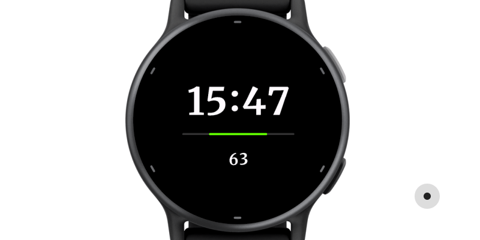

## Cor Tempus

A simple watch face for AMOLED Garmin watches.

The watch face shows the time, battery level and one data field, defaulting to the heart rate.

Available from the Garmin Store here - https://apps.garmin.com/apps/a2e6aba0-9c45-4f57-8bb8-14bdc8bbc57c

### Battery level

When the battery is over 20%, its charge is shown only when the watch is awake (in "high-power" mode).

When the battery is 20% or less, the charge is also shown in "always on" mode.

Otherwise, in the "always on" mode, the charge bar is hidden:

### Data field

The field at the bottom is used to display the heart rate, steps or calories.

On watches that support floor counting, it may display that metric as well.

**Tap and hold** to show current data field type.

Tap and hold **again** while the field icon is showing to switch to the next data type.

### Side-loading in the EU

If you are in the EU, the above Store link will likely be broken for you.

You will need to install the watch face manually, see below.

This is due to Garmin's heavy-handed interpretation of the [DSA](https://en.wikipedia.org/wiki/Digital_Services_Act)
and them hiding apps from the EU users unless the developer goes through a fairly invasive "verification" process.
Subjectively, this is hardly worth it for an app that draws a handful of digits and a colored bar on a black background.

Luckily, side-loading on Garmin watches is easy:

* Plug your watch into a computer
* Copy the watch face `.prg` file to `Garmin/Apps` folder on the watch
* Unplug the watch

The `.prg` is model-specific so pick one that matches your watch:

* [epix2](https://github.com/jwdeque/CorTempus/raw/master/prg/2.0/006-B3944-00/Cor%20Tempus%202.0.prg)
* [epix2pro42mm](https://github.com/jwdeque/CorTempus/raw/master/prg/2.0/006-B4312-00/Cor%20Tempus%202.0.prg)
* [epix2pro47mm](https://github.com/jwdeque/CorTempus/raw/master/prg/2.0/006-B4313-00/Cor%20Tempus%202.0.prg)
* [epix2pro51mm](https://github.com/jwdeque/CorTempus/raw/master/prg/2.0/006-B4314-00/Cor%20Tempus%202.0.prg)
* [fenix7](https://github.com/jwdeque/CorTempus/raw/master/prg/2.0/006-B3906-00/Cor%20Tempus%202.0.prg)
* [fenix7pro](https://github.com/jwdeque/CorTempus/raw/master/prg/2.0/006-B4375-00/Cor%20Tempus%202.0.prg)
* [fenix843mm](https://github.com/jwdeque/CorTempus/raw/master/prg/2.0/006-B4534-00/Cor%20Tempus%202.0.prg)
* [fenix847mm](https://github.com/jwdeque/CorTempus/raw/master/prg/2.0/006-B4775-00/Cor%20Tempus%202.0.prg)
* [fenixe](https://github.com/jwdeque/CorTempus/raw/master/prg/2.0/006-B4666-00/Cor%20Tempus%202.0.prg)
* [fr165](https://github.com/jwdeque/CorTempus/raw/master/prg/2.0/006-B4432-00/Cor%20Tempus%202.0.prg)
* [fr165m](https://github.com/jwdeque/CorTempus/raw/master/prg/2.0/006-B4433-00/Cor%20Tempus%202.0.prg)
* [fr265](https://github.com/jwdeque/CorTempus/raw/master/prg/2.0/006-B4257-00/Cor%20Tempus%202.0.prg)
* [fr265s](https://github.com/jwdeque/CorTempus/raw/master/prg/2.0/006-B4258-00/Cor%20Tempus%202.0.prg)
* [fr965](https://github.com/jwdeque/CorTempus/raw/master/prg/2.0/006-B4315-00/Cor%20Tempus%202.0.prg)
* [venu2](https://github.com/jwdeque/CorTempus/raw/master/prg/2.0/006-B3703-00/Cor%20Tempus%202.0.prg)
* [venu2plus](https://github.com/jwdeque/CorTempus/raw/master/prg/2.0/006-B3851-00/Cor%20Tempus%202.0.prg)
* [venu2s](https://github.com/jwdeque/CorTempus/raw/master/prg/2.0/006-B3704-00/Cor%20Tempus%202.0.prg)
* [venu3](https://github.com/jwdeque/CorTempus/raw/master/prg/2.0/006-B4260-00/Cor%20Tempus%202.0.prg)
* [venu3s](https://github.com/jwdeque/CorTempus/raw/master/prg/2.0/006-B4261-00/Cor%20Tempus%202.0.prg)
* [venusq2](https://github.com/jwdeque/CorTempus/raw/master/prg/2.0/006-B4115-00/Cor%20Tempus%202.0.prg)
* [venusq2m](https://github.com/jwdeque/CorTempus/raw/master/prg/2.0/006-B4116-00/Cor%20Tempus%202.0.prg)
* [vivoactive5](https://github.com/jwdeque/CorTempus/raw/master/prg/2.0/006-B4426-00/Cor%20Tempus%202.0.prg)

